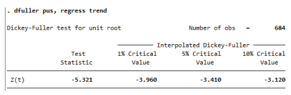
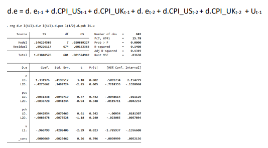

## INDEX: MAIN TOPICS
---
### 1.Regarding file cons.dta: it contains quarterly data on the log of real personal disposable income (Y) and the log of real personal consumption expenditure (C) for the US economy over the period 1960:1 to 2009:4

#### a)Dickey fuller tests to see whether series have a unit root or not

#### b)Estimation of the simple Keynesian consumption function and it implication of non-stationarity of the series for the results of the regression of oncome on consumption expenditure

#### c)Estimation of a DL version of the regression mentioned above

#### d)Calculation and implications of the long run marginal effect of log income on log consumption

### 2.Purchasing Power Parity (PPP) says that prices and exchange rates will remain in equilibrium. We will use the file ppp.dta which contains data on the UK CPI, the US CPI and the $/£ exchange rate.

#### a)Assessing the stationarity of the time series by another Dickey Fuller test

#### b)Testing if time series are cointegrated

#### c)Estimating an error-correction model

